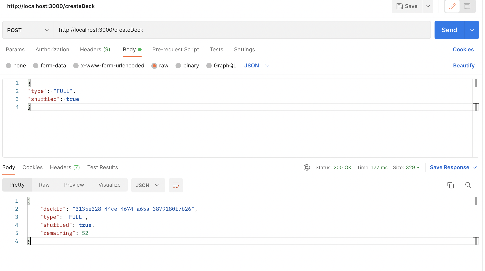
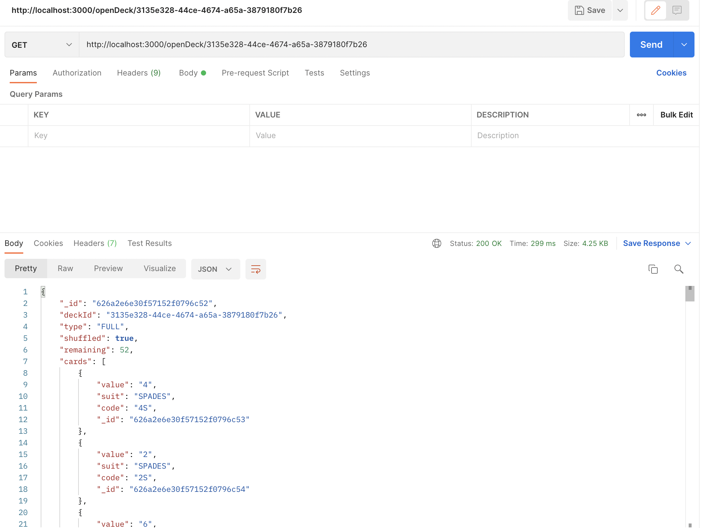
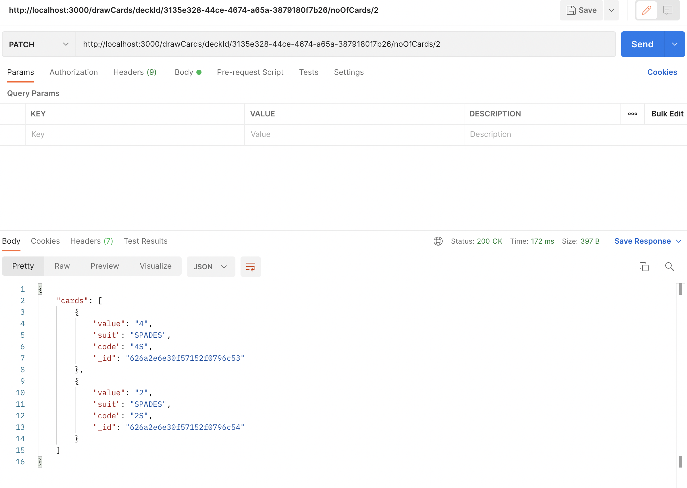

# BlackjackAPI

Please follow the below steps to execute Blackjack API.

### Setup Guide
1. Clone the repository

2. Setting up MongoDB database with docker
    ```
    docker pull mongo
    docker run --name blackJackAPI -d -p 127.0.0.1:27017:27017 mongo
    ```
3. Start the server
    ```
    yarn start
    ```

### Blackjack API

1. Create New Deck

    #### Request
    ```
    /createDeck
    ```
    #### Method
        POST

    #### Sample Request Body
    ```
    {
    "type": "FULL",
    "shuffled": false
    }
    ```

    #### Sample Response
    

2. Open Deck

    #### Request
    ```
    /openDeck/:DeckId
    ```
    #### Method
        GET

    #### Sample Response
    

3. Draw Cards

    #### Request
    ```
    /drawCards/deckId/:DeckId/noOfCards/:NoOfCards
    ```
    #### Method
        PATCH

    #### Sample Response
    


